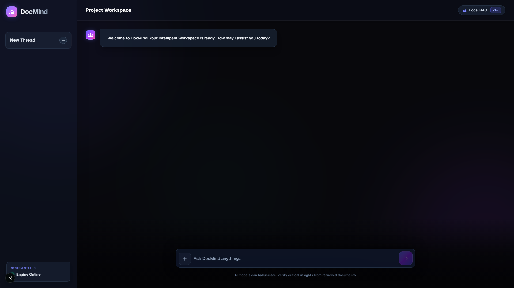

<div align="center">

# 🧠 DocMind Web App

**A powerful, next-generation Retrieval-Augmented Generation (RAG) framework for building responsive, reliable AI & LLM applications.**

[](https://nextjs.org/)
[](https://fastapi.tiangolo.com/)
[](https://tailwindcss.com/)
[](https://www.python.org/)
[](https://opensource.org/licenses/MIT)

[Explore the Docs](#) · [Report Bug](#) · [Request Feature](#)

</div>

---

## 🌟 Overview

Welcome to **DocMind**! This project is designed to bridge the gap between large language models and your private or specialized documents. By leveraging a state-of-the-art **Retrieval-Augmented Generation (RAG)** pipeline, DocMind ensures that your AI applications are grounded in truth, significantly reducing hallucinations and improving answer relevance.

Whether you're building a knowledge-base chatbot, an enterprise search engine, or a personal AI research assistant, DocMind provides a scalable, fast, and secure foundation.

## 📸 Sneak Peek

<div align="center">
  
  <br>
  <em>Clean, responsive, glassmorphic UI built with Next.js and Tailwind CSS.</em>
</div>

## ✨ Key Features

*   **⚡ Blazing Fast API**: Built on top of FastAPI for highly concurrent, asynchronous Python endpoints.
*   **🧠 Advanced RAG Engine**: Optimized document ingestion, chunking, embedding, and semantic search retrieval.
*   **💻 Modern Frontend**: A beautiful, interactive spa built with strictly-typed React and Next.js.
*   **🎨 Premium Design**: Featuring a tailored visual experience with dark mode support, glassmorphism, and fluid animations.
*   **🔒 Secure & Private**: Designed to run locally or be securely deployed to cloud providers like Render.

## 🛠️ Architecture Stack

| Component | Technology | Description |
| :--- | :--- | :--- |
| **Frontend UI** | `Next.js`, `React`, `Tailwind CSS` | Handles user interactions, document uploads, and rendering chat interfaces. |
| **Backend API** | `FastAPI`, `Python 3.11+` | Manages LLM orchestration, vector database operations, and API routing. |
| **AI / RAG Core**| `LangChain`, `OpenAI` / `HuggingFace` | The intelligence engine mapping context to reliable generative responses. |

## 🚀 Getting Started

### Prerequisites
Make sure you have the following installed on your machine:
*   [Node.js](https://nodejs.org/) (v18+)
*   [Python](https://www.python.org/) (3.10+)
*   Git

### Installation & Run

1. **Clone the repository**
   ```bash
   git clone https://github.com/niroopn2005-art/docmind-web-app.git
   cd docmind-web-app
   ```

2. **Start the Backend**
   ```bash
   # Create a virtual environment and install dependencies
   python -m venv venv
   source venv/bin/activate  # On Windows: .\venv\Scripts\activate
   pip install -r requirements.txt
   
   # Run the FastAPI server
   python main.py
   ```

3. **Start the Frontend** (In a new terminal)
   ```bash
   cd frontend
   npm install
   npm run dev
   ```

4. **Experience DocMind**: Open [http://localhost:3000](http://localhost:3000) in your browser!

## 🤝 Contributing

Contributions are what make the open-source community such an amazing place to learn, inspire, and create. Any contributions you make are **greatly appreciated**.

1. Fork the Project
2. Create your Feature Branch (`git checkout -b feature/AmazingFeature`)
3. Commit your Changes (`git commit -m 'Add some AmazingFeature'`)
4. Push to the Branch (`git push origin feature/AmazingFeature`)
5. Open a Pull Request

---
<div align="center">
  <b>Built with passion by <a href="https://github.com/niroopn2005-art">Niroop</a></b>
</div>
